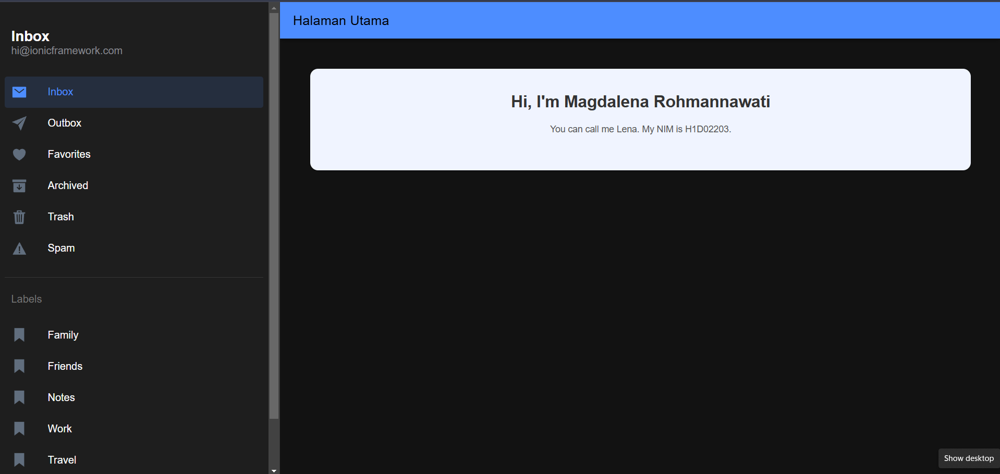

# FirstApp
## Penjelasan

1. Buka Proyek di Code Editor
Pastikan proyek Ionic Anda sudah terbuka di editor seperti Visual Studio Code atau editor pilihan Anda.
2. Buat Halaman Utama
file halaman utama terletak di folder src/app/folder/ dengan nama file home.page.html, home.page.ts, dan home.page.scss.

3. Tambahkan Komponen Ionic pada home.page.html
Buka file home.page.html dan tambahkan komponen Ionic.
Ion Header dan Toolbar:

<ion-header>
  <ion-toolbar color="primary">
    <ion-title>
      Halaman Utama
    </ion-title>
  </ion-toolbar>
</ion-header>
Bagian ini menciptakan header berwarna primary dengan judul Halaman Utama.
Ion Content dengan Card Profil:

<ion-content class="ion-padding">
  

    <ion-card class="profile-card">
      <ion-card-header>
        <ion-card-title>Hi, I'm Magdalena Rohmannawati</ion-card-title>
      </ion-card-header>
      <ion-card-content>
        
You can call me Lena. My NIM is H1D02203.

      </ion-card-content>
    </ion-card>
  

</ion-content>
Bagian ini membuat konten dengan card untuk menampilkan informasi nama dan NIM.
Class ion-padding memberi padding pada konten untuk tampilan yang lebih rapi.
4. Tambahkan Komponen Ionic pada folder.page.scss
.profile-section: Mengatur teks agar berada di tengah dan menambahkan padding di sekelilingnya.

.profile-section {
  text-align: center;
  padding: 20px;
}
.profile-card: Mengatur latar belakang card, menambahkan border-radius agar card lebih membulat, menambahkan padding dalam card, dan mengatur warna teks di dalamnya.

.profile-card {
  background-color: #f0f4ff;
  border-radius: 12px;
  padding: 20px;
  color: #333;
}
ion-card-title: Mengatur ukuran font dan ketebalan teks untuk judul dalam card agar lebih besar dan lebih menonjol.

ion-card-title {
  font-size: 1.8em;
  font-weight: bold;
  color: #333;
}
p: Mengatur warna teks paragraf dan menambahkan margin di bawahnya.

p {
  color: #555;
  margin-bottom: 20px;
}
.buttons ion-button: Menambahkan margin pada tombol-tombol yang berada di dalam elemen dengan class buttons agar tidak terlalu berdekatan.

.buttons ion-button {
  margin: 5px;
}
.about-section: Menambahkan gaya untuk bagian about dengan latar belakang warna terang, padding, text-align center, margin-top untuk jarak dari elemen di atasnya, dan border-radius.

.about-section {
  background-color: #f9f9f9;
  padding: 20px;
  text-align: center;
  margin-top: 30px;
  border-radius: 12px;
}
h2: Mengatur warna, ukuran font, dan margin bawah untuk elemen h2.

h2 {
  color: #333;
  font-size: 1.5em;
  margin-bottom: 10px;
}
